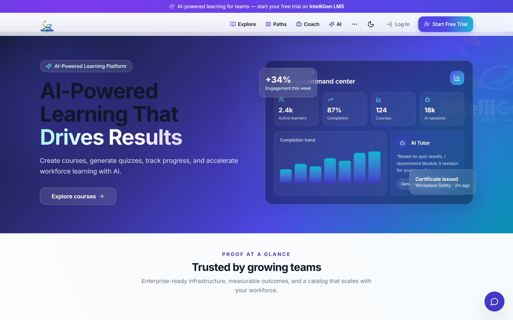
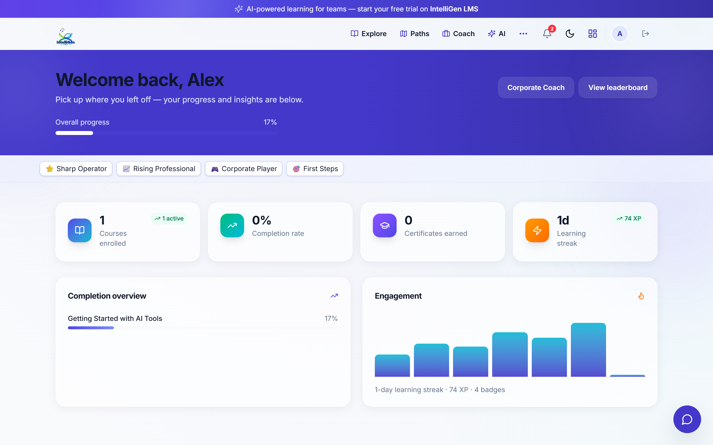
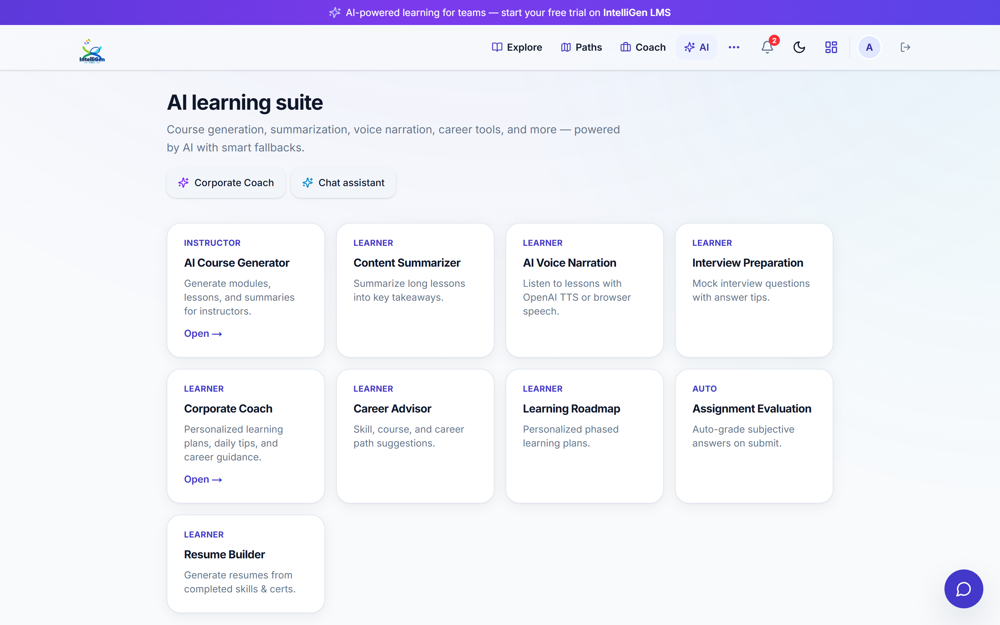
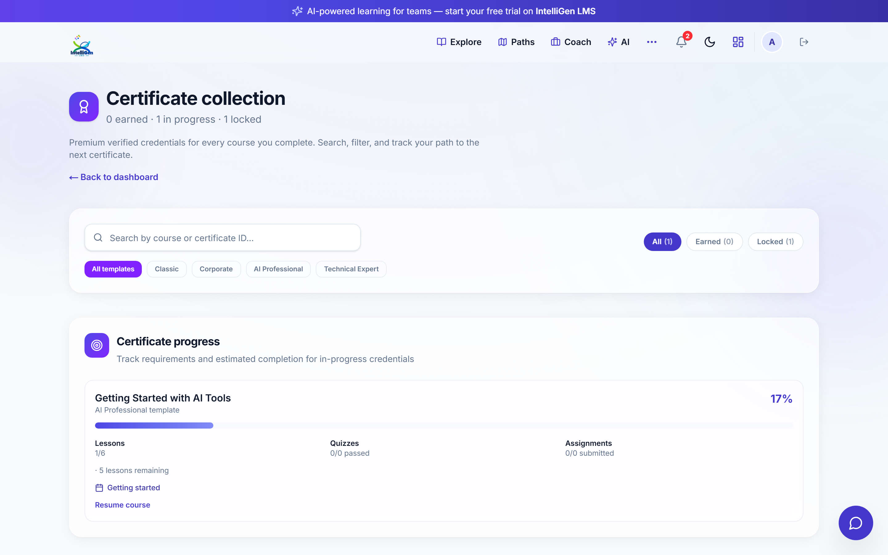
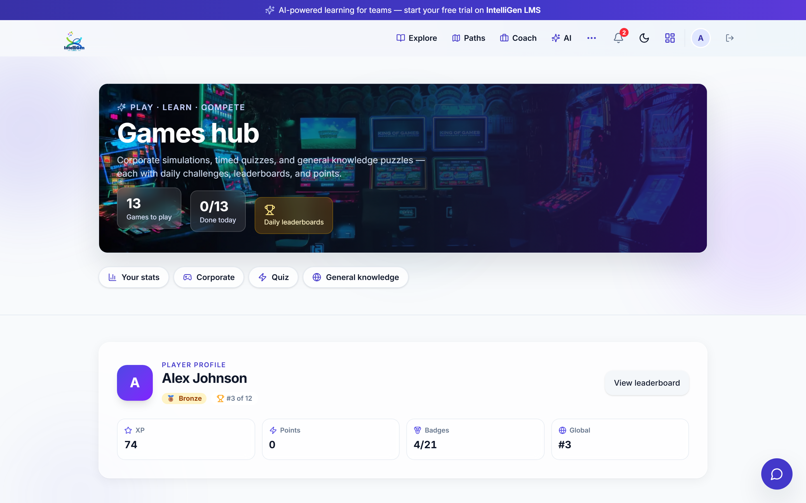
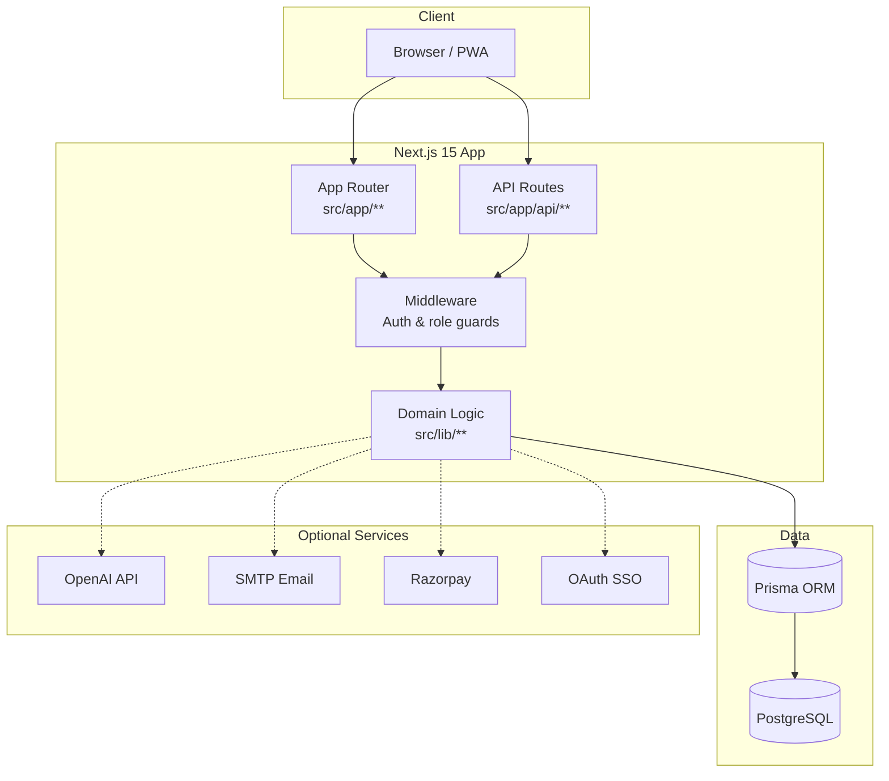

<div align="center">

# IntelliGen LMS

**AI-Powered Learning Management System**

[](https://nextjs.org/)
[](https://react.dev/)
[](https://www.typescriptlang.org/)
[](https://tailwindcss.com/)
[](https://www.prisma.io/)
[](https://www.postgresql.org/)
[](https://nodejs.org/)
[]()

Modern, full-stack LMS for enterprises, training teams, and ed-tech — with AI-native course creation, gamified learning, verifiable certificates, and role-based analytics.

[Live Demo](https://intelligen-lms.vercel.app) · [Features](./FEATURES.md) · [Deploy Guide](./DEPLOY.md) · [Product Tour](https://intelligen-lms.vercel.app/product-tour) · [Showcase](https://intelligen-lms.vercel.app/showcase)

</div>

---

## Overview

**IntelliGen LMS** is a production-ready learning platform that combines traditional LMS capabilities with an integrated AI suite, corporate training games, and multi-tenant organization workspaces. Built on the Next.js App Router, it delivers server-rendered dashboards, secure session authentication, and a polished dark-mode UI suitable for demos, pilots, and production deployments.

Whether you are onboarding employees, selling online courses, or running compliance training, IntelliGen LMS provides the tools to **create**, **deliver**, **measure**, and **motivate** learning at scale.

| | |
|---|---|
| **87+ tracked features** | Courses, AI, games, orgs, commerce, security — see [FEATURES.md](./FEATURES.md) |
| **Demo-ready** | One-click demo accounts and optional `NEXT_PUBLIC_DEMO_MODE` for presentations |
| **Deploy anywhere** | Vercel + PostgreSQL (Railway, Neon, Supabase) — see [DEPLOY.md](./DEPLOY.md) |

---

## Key Features

### AI Course Generation
Generate full course outlines, modules, and lessons from a topic, PDF uploads, or video sources. Instructors refine AI output in the course builder before publishing.

### AI Quiz Builder
Auto-generate multiple-choice quizzes from lesson content. Cron-backed batch generation keeps assessments fresh without manual effort.

### AI Learning Assistant
Context-aware chat assistant helps learners summarize lessons, answer questions, and stay on track — powered by OpenAI when configured.

### Certificates
Automatically issue printable, verifiable certificates on course completion. Public verification links and org-branded templates for enterprise deployments.

### Gamification
Points, badges, and achievements reward consistent learning. Learners earn recognition for quizzes, assignments, streaks, and game participation.

### Analytics
Role-based dashboards surface enrollment trends, completion rates, and learner activity. Instructors and admins get actionable insights at a glance.

### Leaderboards
Global and weekly rankings drive friendly competition. Corporate game leaderboards add daily and mastery-tier badges for workplace training.

### Dashboard
Unified home for students, instructors, and admins — personalized recommendations, progress widgets, and quick links to active courses.

### Authentication
Email/password registration, TOTP two-factor authentication, backup codes, OAuth SSO (Google, Microsoft, Okta), device management, and GDPR export/deletion tools.

### Dark Mode
System-aware light/dark themes across marketing pages, dashboards, and the learning player — consistent, accessible, and modern.

<details>
<summary><strong>More capabilities</strong></summary>

- **Learning paths & competency mapping** — Multi-course curricula and skill assessments
- **Corporate training games** — Cybersecurity, compliance, sales, leadership simulators
- **Quiz challenges** — Daily and weekly timed challenges with flashcards and trivia
- **Organizations** — Multi-tenant workspaces with CSV member import and org analytics
- **Commerce** — Razorpay payments and subscription plans (India)
- **Offline downloads** — Save lessons for offline reading
- **PWA & push notifications** — Optional Web Push via VAPID keys

</details>

---

## Screenshots

> Add screenshots to `docs/screenshots/` and replace the paths below.

<table>
  <tr>
    <td align="center" width="50%">
      <strong>Homepage</strong><br/><br/>
      
      <br/><sub>Marketing landing with product tour and demo video</sub>
    </td>
    <td align="center" width="50%">
      <strong>Dashboard</strong><br/><br/>
      
      <br/><sub>Personalized progress, courses, and recommendations</sub>
    </td>
  </tr>
  <tr>
    <td align="center" width="50%">
      <strong>AI Features</strong><br/><br/>
      
      <br/><sub>Assistant, coach, course generator, and career tools</sub>
    </td>
    <td align="center" width="50%">
      <strong>Certificates</strong><br/><br/>
      
      <br/><sub>Issued credentials with print and public verification</sub>
    </td>
  </tr>
  <tr>
    <td align="center" colspan="2">
      <strong>Game Hub</strong><br/><br/>
      
      <br/><sub>Corporate simulators, quiz challenges, and knowledge games</sub>
    </td>
  </tr>
</table>

---

## Tech Stack

| Layer | Technology |
|-------|------------|
| **Framework** | [Next.js](https://nextjs.org/) 15 (App Router, Server Components) |
| **UI** | [React](https://react.dev/) 19, [TypeScript](https://www.typescriptlang.org/), [Tailwind CSS](https://tailwindcss.com/) 4 |
| **Database** | [PostgreSQL](https://www.postgresql.org/) via [Prisma](https://www.prisma.io/) 6 ORM |
| **Auth** | Jose (JWT sessions), bcryptjs, otplib (2FA) |
| **AI** | OpenAI API (optional) |
| **Charts** | Recharts |
| **Email** | Nodemailer (SMTP) |
| **Payments** | Razorpay (optional) |
| **Validation** | Zod |

---

## Architecture Overview

IntelliGen LMS is a **monolithic Next.js application** — UI, API routes, and server logic live in one deployable unit. Prisma connects to PostgreSQL; optional integrations (OpenAI, SMTP, Razorpay, OAuth) are env-gated.



| Path | Purpose |
|------|---------|
| `src/app/**` | Routes, pages, and layouts (marketing, dashboard, learn player) |
| `src/app/api/**` | REST handlers for auth, courses, AI, games, admin |
| `src/lib/**` | Business logic — auth, progress, certificates, demo layer |
| `src/components/**` | Reusable UI — layout, forms, games, demo banners |
| `prisma/schema.prisma` | Data model (users, courses, orgs, games, commerce) |
| `src/middleware.ts` | Session validation and role-based route protection |

**Roles:** Student · Instructor · Admin · Organization Admin (multi-tenant workspaces)

---

## Installation

### Prerequisites

- **Node.js** 20+
- **npm** 10+
- **Docker** (recommended for local PostgreSQL)

### Quick start

```bash
# 1. Clone the repository
git clone https://github.com/akhilesh1305/intelligen-lms.git
cd intelligen-lms

# 2. Start PostgreSQL
docker compose up -d

# 3. Configure environment
cp .env.example .env

# 4. Install dependencies and seed the database
npm install
npm run db:setup

# 5. Start the development server
npm run dev
```

Open **[http://localhost:3001](http://localhost:3001)** in your browser.

### Useful scripts

| Command | Description |
|---------|-------------|
| `npm run dev` | Start dev server on port 3001 |
| `npm run build` | Production build |
| `npm run db:push` | Push Prisma schema to database |
| `npm run db:seed` | Seed users, courses, and demo data |
| `npm run db:seed-org` | Seed demo organization workspace |
| `npm run lint` | Run ESLint |

For production deployment, see **[DEPLOY.md](./DEPLOY.md)**.

---

## Environment Variables

Copy `.env.example` to `.env` and configure as needed.

### Required

| Variable | Description |
|----------|-------------|
| `DATABASE_URL` | PostgreSQL connection string |
| `SESSION_SECRET` | Long random string for session signing (`openssl rand -base64 32`) |
| `PORT` | Local dev port (default `3001`) |

### Recommended (production)

| Variable | Description |
|----------|-------------|
| `NEXT_PUBLIC_APP_URL` | Public app URL (e.g. `https://intelligen-lms.vercel.app`) |
| `AVATAR_STORAGE` | `filesystem` (local) or `database` (serverless) |
| `CRON_SECRET` | Protects `/api/cron/generate-quizzes` |

### Optional integrations

| Variable | Description |
|----------|-------------|
| `OPENAI_API_KEY` | Enables AI assistant, course generator, quiz builder |
| `OPENAI_MODEL` | Model name (default `gpt-4o-mini`) |
| `SMTP_*` | Outbound email for 2FA backup and notifications |
| `RAZORPAY_*` | Course purchases and subscriptions (India) |
| `GOOGLE_*` / `MICROSOFT_*` / `OKTA_*` | Enterprise SSO providers |
| `NEXT_PUBLIC_VAPID_*` / `VAPID_*` | Web Push notifications |
| `ENCRYPTION_KEY` | Encrypts 2FA secrets at rest |
| `NEXT_PUBLIC_DEMO_MODE` | `true` to overlay mock data on dashboards |

Without SMTP, emails are logged to the console in development. Without OpenAI, AI features show graceful fallbacks or remain disabled.

---

## Demo Credentials

Use these accounts after running `npm run db:setup` (or `npm run db:seed`).

### Presentation demo accounts

Purpose-built for recruiter and client demos — rich mock data on dashboards without enabling env flags.

| Role | Email | Password |
|------|-------|----------|
| **Demo Admin** | `demo-admin@intelligen.lms` | `password123` |
| **Demo Learner** | `demo-learner@intelligen.lms` | `password123` |

Sign in at `/login` or use the **Try Demo** buttons on the login page.

### Seed accounts (full platform roles)

| Role | Email | Password |
|------|-------|----------|
| **Admin** | `admin@intelligen.lms` | `password123` |
| **Instructor** | `instructor@intelligen.lms` | `password123` |
| **Student** | `student@intelligen.lms` | `password123` |

> **Tip:** Set `NEXT_PUBLIC_DEMO_MODE=true` in `.env` to populate dashboards with presentation mock data for any signed-in user.

---

## Future Roadmap

| Phase | Focus |
|-------|-------|
| **Q3 2026** | Org admin analytics demo layer, real screenshot assets, SCORM import pilot |
| **Q4 2026** | Advanced reporting exports, custom branding per org, webhook integrations |
| **2027** | Mobile companion app, xAPI/LRS support, marketplace for third-party courses |
| **Ongoing** | Expanded AI coaching, more corporate game scenarios, accessibility (WCAG 2.2) |

Contributions and feature requests are welcome — see [FEATURES.md](./FEATURES.md) for the current capability inventory.

---

## License

Copyright © 2026 IntelliGen LMS. All rights reserved.

This software is proprietary. Unauthorized copying, distribution, or use outside of licensed deployments is not permitted. Contact the maintainers for commercial licensing inquiries.

---

<div align="center">

**Built with Next.js · Prisma · PostgreSQL**

[⬆ Back to top](#intelligen-lms)

</div>
